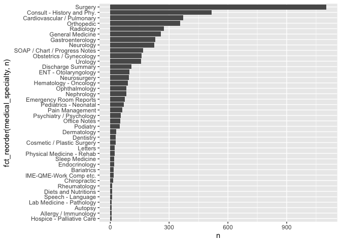

Lab 06
================
Sylvia Baeyens
8/1/2021

Reading in Data

``` r
rawData= "mtsamples.csv"
if(!file.exists(rawData))
  download.file("https://raw.githubusercontent.com/USCbiostats/data-science-data/master/00_mtsamples/mtsamples.csv", destfile = rawData)

mtsamples= read.csv(rawData) 
mtsamples= as_tibble(mtsamples)
```

## 1. What specialties do we have?

First, we count the number of specialties

``` r
Nspecialties = mtsamples %>%
  count(medical_specialty)

Nspecialties %>%
  arrange(desc(n)) %>%
  top_n(15) %>%
  knitr::kable()
```

    ## Selecting by n

| medical\_specialty            |    n |
|:------------------------------|-----:|
| Surgery                       | 1103 |
| Consult - History and Phy.    |  516 |
| Cardiovascular / Pulmonary    |  372 |
| Orthopedic                    |  355 |
| Radiology                     |  273 |
| General Medicine              |  259 |
| Gastroenterology              |  230 |
| Neurology                     |  223 |
| SOAP / Chart / Progress Notes |  166 |
| Obstetrics / Gynecology       |  160 |
| Urology                       |  158 |
| Discharge Summary             |  108 |
| ENT - Otolaryngology          |   98 |
| Neurosurgery                  |   94 |
| Hematology - Oncology         |   90 |

There are 40 specialties.

Next, we look at distribution:

``` r
#using method 2 from class:

ggplot(Nspecialties, aes(x = n, y = fct_reorder(medical_specialty, n))) +
  geom_col()
```

<!-- -->

There is no even distribution among the 40 specialties. Surgery has the
highest count, while hospice-pallative care has the lowest count.

## 2. Tokenizing the words in the transcription column

Tokenizing words & visualizing top 20:

``` r
mtsamples %>%
  unnest_tokens(output= word, input= transcription) %>%
  count(word, sort= TRUE) %>%
  top_n(20) %>%
  ggplot(aes(x = n, y = fct_reorder(word, n))) +
  geom_col()
```

    ## Selecting by n

<!-- -->

The word “patient” is the most common non-filler word. Pronouns are also
common words. However, the most common words include “the” and “and.”
This makes sense, as filler/stop words are very common in written
language.

## 3. Repeating Q2 but Removing stopwords

``` r
mtsamples %>%
  unnest_tokens(output= word, input= transcription) %>%
  count(word, sort= TRUE) %>%
  anti_join(stop_words, by = "word") %>%
  #using method from class (regular expressions) to remove numbers too
  filter(!grepl(pattern= "^[0-9]+$", x= word)) %>%
  top_n(20) %>%
  ggplot(aes(x = n, y = fct_reorder(word, n))) +
  geom_col()
```

    ## Selecting by n

<!-- -->

Now that we have removed all the stop words and numbers, we see many
medical terms among the top 20 most common words. These words include
“blood,” “skin,” “anesthesia” and “artery.” The other words among this
list make sense given the medical environment.

## 4. Repeating Q2 but tokenizing into bigrams & trigrams

Starting with bigrams:

``` r
mtsamples %>%
  unnest_ngrams(output= bigram, input= transcription, n=2) %>%
  count(bigram, sort= TRUE) %>%
  top_n(20) %>%
  ggplot(aes(x = n, y = fct_reorder(bigram, n))) +
  geom_col()
```

    ## Selecting by n

<!-- --> When using
bigrams, we see many 2 word phrases with stop words show.

Moving onto trigrams:

``` r
mtsamples %>%
  unnest_ngrams(output= trigram, input= transcription, n=3) %>%
  count(trigram, sort= TRUE) %>%
  top_n(20) %>%
  ggplot(aes(x = n, y = fct_reorder(trigram, n))) +
  geom_col()
```

    ## Selecting by n

<!-- --> When trigrams
are visualized, we see more phrases that make sense in the medical
environment, such as “past medical history” and “the operating room”,
but there are still many phrases with more than one stop word.

# 5. Zooming in on 1 specific word

The word chosen is “procedure”.

``` r
bigram = mtsamples %>%
  unnest_ngrams(output= bigram, input= transcription, n=2) %>%
  separate(bigram, into= c("wordA", "wordB"), sep = " ") %>%
  filter((wordA== "procedure")| (wordB == "procedure"))

bigram %>%
  filter(wordA== "procedure") %>%
  select(wordA, wordB) %>%
  count(wordB, sort = TRUE)
```

    ## # A tibble: 404 × 2
    ##    wordB         n
    ##    <chr>     <int>
    ##  1 the        1269
    ##  2 well       1025
    ##  3 performed   651
    ##  4 in          459
    ##  5 was         424
    ##  6 after       320
    ##  7 and         239
    ##  8 were        144
    ##  9 this        104
    ## 10 1           103
    ## # … with 394 more rows

``` r
bigram %>%
  filter(wordB== "procedure") %>%
  select(wordA, wordB) %>%
  count(wordA, sort = TRUE)
```

    ## # A tibble: 671 × 2
    ##    wordA         n
    ##    <chr>     <int>
    ##  1 the        2833
    ##  2 of          560
    ##  3 operative   252
    ##  4 for         195
    ##  5 this        164
    ##  6 same         72
    ##  7 none         69
    ##  8 surgical     58
    ##  9 similar      57
    ## 10 entire       49
    ## # … with 661 more rows

& now we remove the stop words again

``` r
bigram %>%
  filter(wordA == "procedure") %>%
  filter(!(wordB %in% stop_words$word) & !grepl("^[0-9]+$", wordB)) %>%
  count(wordB, sort = TRUE) %>%
  top_n(10) %>%
  knitr::kable(caption = "Words AFTER 'procedure'")
```

    ## Selecting by n

| wordB        |   n |
|:-------------|----:|
| performed    | 651 |
| details      |  62 |
| detail       |  56 |
| left         |  53 |
| note         |  48 |
| procedure    |  48 |
| laparoscopic |  41 |
| including    |  39 |
| bilateral    |  34 |
| patient      |  32 |

Words AFTER ‘procedure’

``` r
bigram %>%
  filter(wordB == "procedure") %>%
  filter(!(wordA %in% stop_words$word) & !grepl("^[0-9]+$", wordA)) %>%
  count(wordA, sort = TRUE) %>%
  top_n(10) %>%
  knitr::kable(caption = "Words BEFORE 'procedure'")
```

    ## Selecting by n

| wordA     |   n |
|:----------|----:|
| operative | 252 |
| surgical  |  58 |
| similar   |  57 |
| entire    |  49 |
| procedure |  48 |
| obtained  |  46 |
| post      |  39 |
| proceed   |  36 |
| foot      |  33 |
| eye       |  32 |

Words BEFORE ‘procedure’
